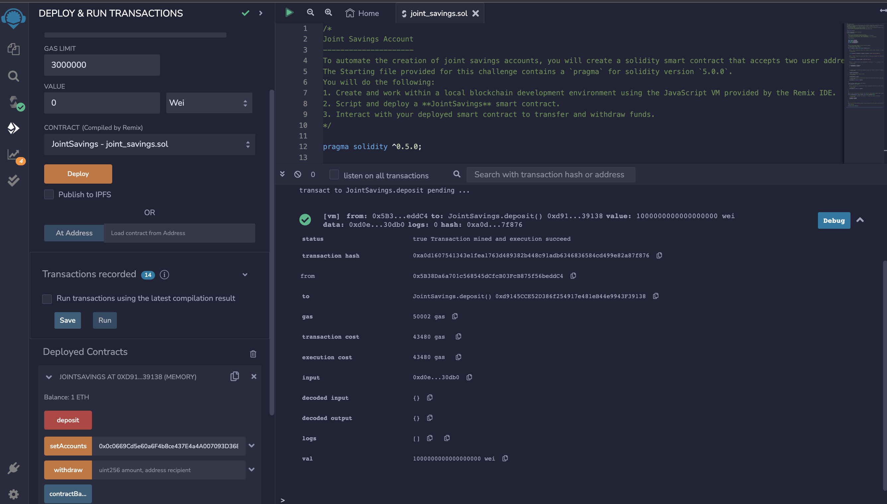
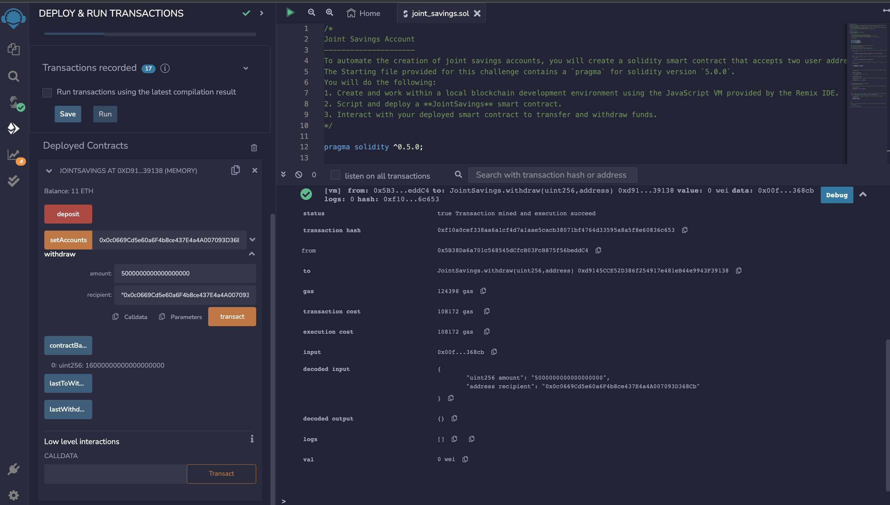

# Smart Contracts

To automate the creation of joint savings accounts, you’ll create a Solidity smart contract that accepts two user addresses. These addresses will be able to control a joint savings account. Your smart contract will use ether management functions to implement a financial institution’s requirements for providing the features of the joint savings account. These features will consist of the ability to deposit and withdraw funds from the account.

---

## Technologies

_[Solidity](https://soliditylang.org/)_ - This is a programming language we used to create smart contracts.

_[Remix IDE website](https://remix.ethereum.org/)_ - This is where we build and test smart contracts that we create with Solidity.

---

## Usage 

The contract is the joint_savings.sol file in this repository. Open the remix ide webpage and then compile/deploy the contract.

* First: Set the two accounts.

* Then you make a deposit.
  

* Last and certainly not least, withdraw.
  

---

## Contributors

<b> _G. Cale McDowell_

_[@gcm107](https://github.com/gcm107)_

